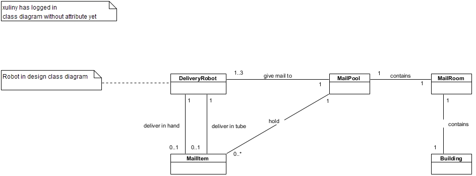
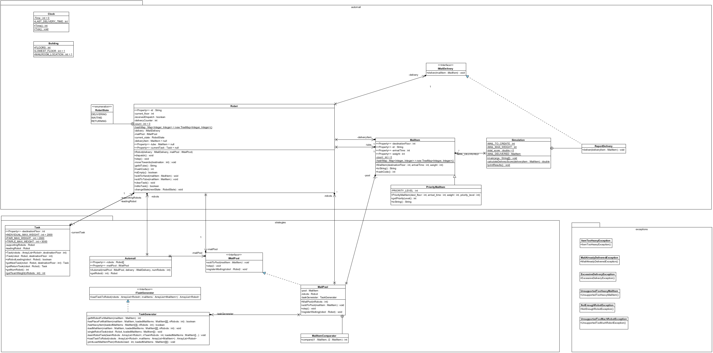
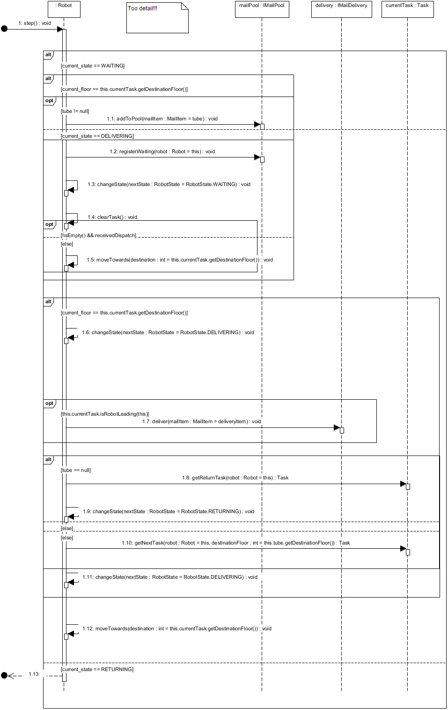

# smd-project1
Private Repo for SMD project1

### Code Style Guide:
- [GoogleJavaStyleGuide](https://google.github.io/styleguide/javaguide.html)

### Mardown Guide
- [Markdown File (.md) guide](https://guides.github.com/features/mastering-markdown/)

### Submission Checklist
1. Your complete updated source code package reflecting your new design and implementation (all
Java source with top-level folder called “swen30006”).
2. Design Analysis Report (pdf).
3. Static Domain Model (pdf or png).
4. Static Design Model reflecting your new design and implementation (pdf or png).
5. Dynamic Design Diagram reflecting your new design and implementation (pdf or png).

# Static Domain Diagram

# Static Design Diagram

# Dynamic Design Diagram

